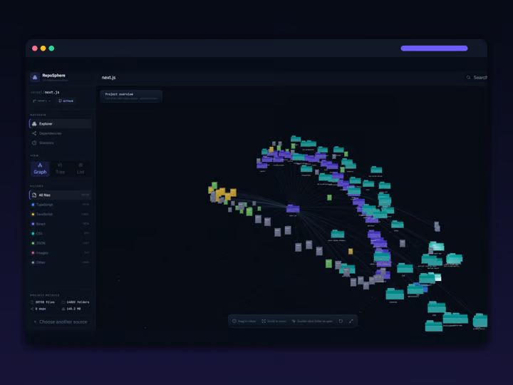

# RepoSphere

**Live demo:** [repo-sphere-eight.vercel.app](https://repo-sphere-eight.vercel.app)



RepoSphere is a Next.js application for exploring the real structure of a public GitHub repository or a local project folder as an interactive 3D graph.

## Stack

- Next.js (App Router), React 19, TypeScript
- Three.js with React Three Fiber and Drei for the 3D graph
- Framer Motion, Tailwind CSS v4, Lucide icons
- GitHub REST API (git trees + contents) and the File System Access API for local folders
- tsx-based tests, ESLint

## Local development

```bash
npm install
npm run dev
```

The GitHub loader resolves the repository's default branch, retrieves its complete Git tree, and reads real source contents for dependency analysis without unpacking enormous archives in the browser. Local folders are read with `showDirectoryPicker()` where available, with a `webkitdirectory` fallback. Both loaders feed the same normalized project, dependency-analysis, and layout pipeline.
